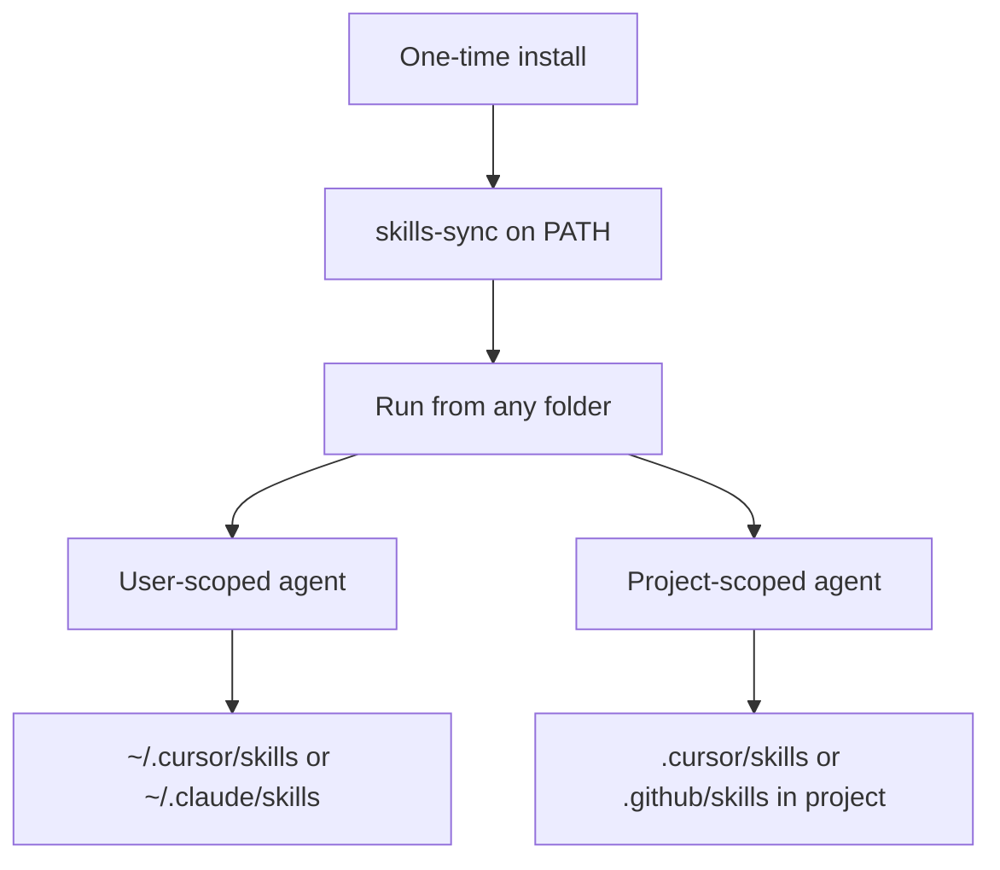
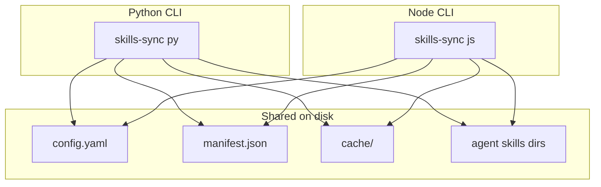
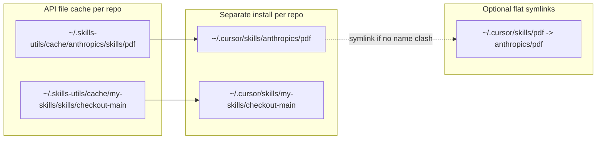
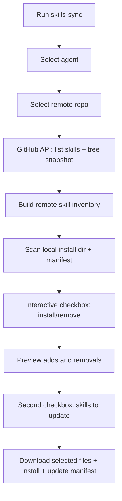
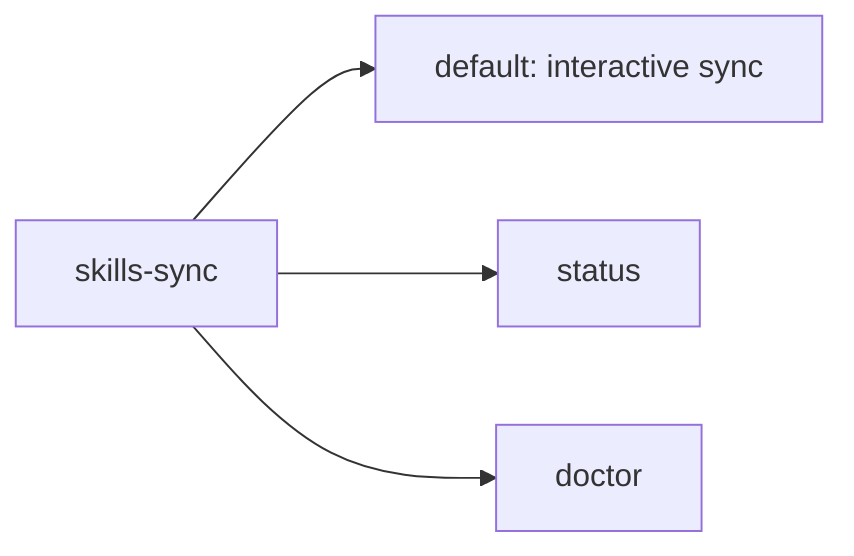

# Skills Sync CLI — Implementation Plan

> Sync agent skills from GitHub repos via API (no git clone). Dual Python + Node CLIs with interactive sync, `status`, and `doctor` commands.

## Implementation todos

- [x] Add shared `config.yaml` at repo root; document manifest schema in `docs/manifest-schema.md`
- [x] Scaffold `python/` package (pyproject.toml, src/skills_utils/)
- [x] Scaffold `node/` package (package.json, TypeScript src/)
- [x] Python core: github, repos, hash, manifest
- [x] Node core: same logic, same outputs as Python
- [x] Python CLI: agents, scanner, diff, sync, ui, status, doctor
- [x] Node CLI: mirror Python
- [x] README, parity tests, manual verification

---

## Context

This repo is a greenfield project (README + LICENSE only). Skills on your machine live in several places:

| Agent | User skills dir (managed by this tool) | Do NOT touch |
|-------|----------------------------------------|--------------|
| **Cursor** | `~/.cursor/skills/` | `~/.cursor/skills-cursor/` (Cursor-managed) |
| **Claude Code** | `~/.claude/skills/` (personal) | `~/.claude/plugins/cache/` (plugin-managed) |
| **Claude Code project** | `<repo>/.claude/skills/` | — |
| **Copilot** | Project: `.github/skills/` or `.agents/skills/` (configurable) | Extension-bundled skills |
| **Cursor project** | `<repo>/.cursor/skills/` | — |

Remote source default: [`anthropics/skills`](https://github.com/anthropics/skills) with skills at `skills/<name>/SKILL.md` (17 skills today: `pdf`, `docx`, `skill-creator`, etc.).

## Dual runtime strategy

Build **two equivalent CLIs** — Python and Node.js — that share the same on-disk state so you can use either interchangeably:

| Shared (single source of truth) | Per-runtime |
|---------------------------------|-------------|
| [`config.yaml`](../config.yaml) at repo root | CLI entry + interactive prompts |
| [`~/.skills-utils/manifest.json`](~/.skills-utils/manifest.json) | HTTP client library |
| [`~/.skills-utils/cache/`](~/.skills-utils/cache/) file cache | Hash/fingerprint algorithms (must match) |
| Install layout under agent skills dirs | Package manager / build |

**Entry points:**
- Python: `skills-sync` via `pip install -e python/` or `python -m skills_utils`
- Node: `skills-sync` via `npm link` in `node/` or `npx skills-sync`

Both produce identical manifest entries, fingerprints, and install paths. A skill installed with Python can be updated/removed with Node and vice versa.

## Installation and running from any folder

After a **one-time install**, `skills-sync` is on your PATH and works from **any directory**. Your current folder only matters when you pick a **project-scoped** agent (e.g. Copilot project → `.github/skills` relative to cwd or git root).



### One-time install (pick Python **or** Node — not both on PATH)

**Option A — Python (recommended if you have Python 3.10+):**
```bash
git clone git@github.com:mariuszizydorek/skills-utils.git
cd skills-utils/python
pip install -e .          # or: pipx install -e .
skills-sync doctor        # verify setup
```

**Option B — Node:**
```bash
git clone git@github.com:mariuszizydorek/skills-utils.git
cd skills-utils/node
npm install && npm run build
npm link                  # puts skills-sync on PATH
skills-sync doctor
```

**Option C — run without installing (dev):**
```bash
# Python
python -m skills_utils          # from skills-utils/python/

# Node
node skills-utils/node/dist/cli.js
```

If both Python and Node are installed globally, they both register `skills-sync` — **pick one**. The plan ships both implementations; use the runtime you prefer.

### Where data lives (always under your home dir)

Everything stateful lives in `~/.skills-utils/` — **not** in the folder you run from:

```
~/.skills-utils/
├── config.yaml       # your repos + agent paths (created on first run)
├── manifest.json     # what's installed, from which repo
└── cache/            # downloaded skill files (on demand)
```

Skills themselves install to agent dirs (also absolute paths):
- `~/.cursor/skills/` — Cursor personal
- `~/.claude/skills/` — Claude Code
- `<project>/.cursor/skills/` — only when you pick project agent **from that project**

### Config resolution order

When you run `skills-sync` from anywhere:

1. `--config /path/to/config.yaml` if passed
2. `$SKILLS_UTILS_CONFIG` env var if set
3. `~/.skills-utils/config.yaml` if it exists
4. **First run:** copy bundled defaults → `~/.skills-utils/config.yaml` and use that

The repo's [`config.yaml`](../config.yaml) is the **template** shipped with the package — not required to stay in the clone after install.

### Typical usage after install

```bash
# From anywhere — personal Cursor skills
cd ~/projects/my-app
skills-sync                    # interactive: pick Cursor → anthropics → tick skills

cd ~/Desktop                   # different folder, same result for user-scoped agents
skills-sync status             # shows what's installed

skills-sync doctor --fix       # health check + repair symlinks

# Project-scoped: run from inside the project (or its git root)
cd ~/projects/my-app
skills-sync                    # pick "Copilot (project)" → installs to ./.github/skills/
```

### What happens on first run

1. Creates `~/.skills-utils/` if missing
2. Writes default `config.yaml` (includes `anthropics/skills` repo)
3. Prompts: pick agent → pick repo → list skills from GitHub API
4. Downloads + installs selected skills to the agent's skills dir
5. Writes `manifest.json` so the next run knows what's already installed

No git clone of skill repos. No need to be inside the `skills-utils` repo after install.

### Updating the tool itself

```bash
cd ~/path/to/skills-utils
git pull
pip install -e python/    # or: cd node && npm run build
```

Your installed skills and manifest in `~/.skills-utils/` are untouched.



## Important constraint: nested install vs agent discovery

**Separate subdirs per repo** (e.g. `~/.cursor/skills/anthropics/pdf/`). Standard agents scan **one level** under the skills root for folders containing `SKILL.md` — they will **not** discover `anthropics/pdf/` automatically.

**Recommended hybrid (honors your layout + keeps agents working):**



- **Cache** (always separate per repo, no git checkout): `~/.skills-utils/cache/<repo-slug>/` — files downloaded on demand via GitHub API
- **Install**: `<skills_dir>/<repo-slug>/<skill-name>/`
- **Discovery symlinks** (optional, default ON when no collision): `<skills_dir>/<skill-name>` → `<repo-slug>/<skill-name>`
- On **name collision** across repos: skip auto-symlink, show warning, keep nested paths only

## Architecture



## Remote fetching: GitHub API only (no git clone)

No local git checkout. All remote operations go through `api.github.com`.

| Purpose | Endpoint | Calls |
|---------|----------|-------|
| **List skill folders** | `GET /repos/{owner}/{repo}/contents/{skills_path}` | 1 |
| **Inventory + change detection** | `GET /repos/{owner}/{repo}/git/trees/{ref}?recursive=1` | 1 |
| **Resolve ref → SHA** | `GET /repos/{owner}/{repo}/commits/{branch}` | 1 (cached per session) |
| **Download file content** | `GET /repos/{owner}/{repo}/git/blobs/{sha}` or raw URL | 1 per file, only for selected skills |

**Session startup**: 2–3 API calls total regardless of repo size.

**On install/update**: download files only for skills the user selected.

### Change detection (no checkout needed)

1. Fetch recursive tree: `GET .../git/trees/main?recursive=1`
2. Filter paths under `skills/{skill-name}/`
3. Compute per-skill **remote fingerprint**: SHA-256 of sorted `{relative_path:blob_sha}` JSON
4. Compare against manifest's stored `remote_fingerprint` → `outdated`
5. Compare local install dir content hash against manifest's `installed_hash` → `modified`

**Parity requirement:** Python and Node must use the same fingerprint and hash algorithms (documented in [`docs/manifest-schema.md`](../docs/manifest-schema.md)).

### Local file cache (not a git repo)

```
~/.skills-utils/cache/anthropics/
├── meta.json                 # { "commit_sha", "fetched_at" }
└── skills/
    └── pdf/                  # populated only after user installs/updates pdf
        ├── SKILL.md
        └── scripts/...
```

### Auth and rate limits

- **Public repos**: works unauthenticated (60 req/hr)
- **Private repos**: auto-detect token from `gh auth token` or `GITHUB_TOKEN` (5000 req/hr)
- Token never stored in config — read at runtime only

## Shared config + manifest

[`config.yaml`](../config.yaml) — bundled template; at runtime resolved to `~/.skills-utils/config.yaml`. Override with `--config` or `SKILLS_UTILS_CONFIG`.

```yaml
repos:
  anthropics:
    owner: anthropics
    repo: skills
    branch: main
    skills_path: skills

agents:
  cursor:
    label: Cursor (personal)
    skills_dir: ~/.cursor/skills
    exclude_dirs: [skills-cursor]
    scope: user
  claude-code:
    label: Claude Code (personal)
    skills_dir: ~/.claude/skills
    scope: user
  claude-code-project:
    label: Claude Code (project)
    skills_dir: .claude/skills
    scope: project
  cursor-project:
    label: Cursor (project)
    skills_dir: .cursor/skills
    scope: project
  copilot-project:
    label: Copilot (project)
    skills_dir: .github/skills
    scope: project

defaults:
  flat_symlinks: true
```

[`~/.skills-utils/manifest.json`](~/.skills-utils/manifest.json):

```json
{
  "version": 1,
  "agents": {
    "cursor": {
      "anthropics/pdf": {
        "repo_slug": "anthropics",
        "remote_path": "skills/pdf",
        "commit_sha": "abc123",
        "remote_fingerprint": "sha256:...",
        "installed_hash": "sha256:...",
        "installed_at": "2026-06-07T12:00:00Z"
      }
    }
  }
}
```

Multi-repo: run once per repo; manifest tracks provenance. Skills from other repos are never removed unless unchecked **and** owned by the current repo.

## CLI UX (identical flow in both runtimes)

### Step 1 — Agent selection
### Step 2 — Repo selection (default: anthropics/skills; can add new)
### Step 3 — Fetch remote inventory (API, ~2–3 calls)
### Step 4 — Skill selection (checkbox list with status symbols)
### Step 5 — Preview + update pass (second checkbox for outdated skills)
### Step 6 — Apply (download, install, symlink, update manifest)

| Symbol | Meaning |
|--------|---------|
| `[x]` pre-ticked | Installed from this repo |
| `[ ]` | Remote only, not installed |
| `[~]` | Installed but modified/outdated |
| `[!]` | Installed from different repo |
| `[?]` | Local, unknown origin |

Status logic: `missing`, `synced`, `outdated`, `modified`, `diverged`

## CLI commands

Three subcommands, identical in Python and Node:

| Command | Mode | Purpose |
|---------|------|---------|
| `skills-sync` | Interactive (default) | Full install/remove/update flow |
| `skills-sync status` | Non-interactive | Print current skill state as table/JSON |
| `skills-sync doctor` | Non-interactive | Health check environment + config + install integrity |



### `skills-sync status` (non-interactive)

```bash
skills-sync status [options]
```

**Options:**
- `--agent ID` — filter to one agent; default: all
- `--repo SLUG` — filter to one repo; default: all
- `--format table|json` — default `table`
- `--check-remote` — fetch tree fingerprints to mark outdated skills
- `--config PATH`

**Exit codes:** `0` synced, `1` outdated/modified/diverged, `2` config error

### `skills-sync doctor` (health check)

```bash
skills-sync doctor [options]
```

**Options:** `--agent ID`, `--fix`, `--config PATH`

**Checks:** config, manifest, skills dirs, symlinks, GitHub API/token, remote repos

**`--fix` safe repairs:** create missing dirs, remove broken symlinks, recreate missing flat symlinks

**Exit codes:** `0` pass, `1` warnings, `2` errors

## Project layout (monorepo)

```
skills-utils/
├── plans/
│   └── skills-sync-cli/
│       └── plan.md                 # this file
├── config.yaml                     # shared by both runtimes
├── README.md                       # install + usage for Python and Node
├── docs/
│   └── manifest-schema.md          # fingerprint/hash spec for parity
├── python/
│   ├── pyproject.toml
│   ├── src/skills_utils/
│   └── tests/
└── node/
    ├── package.json
    ├── tsconfig.json
    ├── src/
    └── tests/
```

## Implementation order

1. Shared spec — `config.yaml`, `docs/manifest-schema.md`, test fixtures
2. Python core — validate against live `anthropics/skills` API
3. Node core — port module-by-module, parity tests
4. Both CLIs — interactive UI + status + doctor
5. README — full user-facing docs

## README outline

The README must explain **what the tool is for** and **how to use it**:

- **Problem/solution** — manage agent skills from GitHub without manual copy-paste
- **Install** — Python or Node (one runtime)
- **Usage walkthrough** — 6-step interactive flow
- **Common workflows** — first setup, private repo, updates, removal, status, doctor
- **Configuration** — config.yaml, manifest, env vars
- **Flags** — all subcommands
- **FAQ** — rate limits, symlinks, multi-repo, Python vs Node

## Edge cases handled

- **Private repos**: `gh auth token` or `GITHUB_TOKEN`
- **Rate limits**: warn when unauthenticated; optional `--token` flag
- **Non-GitHub repos**: not supported in v1
- **Skills without SKILL.md**: skip with warning
- **Cursor built-ins**: exclude `skills-cursor`
- **Manual skills**: show as `[?]`, don't delete unless `--prune-unknown`

## Verification

- Parity tests: identical fingerprints/hashes in Python and Node
- Manual matrix: fresh install, cross-runtime sync, modified/outdated detection, multi-repo, collisions, status, doctor

## Future extensions (out of scope for v1)

- Plugin-format repos (`plugins/foo/skills/bar/`)
- `--dry-run` for interactive sync
- Pin install to specific commit/tag
